# AI Image Manager

**100% 本地 AI 图片管理器** — 用 AI 搜索、整理、筛选你的照片库，完全离线运行。

就地索引文件夹。语义搜索、智能相册、人脸识别、选片筛选、重复检测、云端分享 — 全部在你自己的电脑上运行。

[](#)
[](LICENSE)
[](#)

> **English README**: [README.en.md](README.en.md)
> **使用指南**: [GUIDE.md](GUIDE.md) | **User Guide**: [GUIDE.en.md](GUIDE.en.md)

---

## 下载

从 [Releases](https://github.com/Uyoung666/ai-image-manager/releases) 下载最新版本。Release 中包含操作演示视频。

**安装版（推荐）：** `AI Image Manager-1.3.0 Setup.exe` — 安装到系统默认位置，创建快捷方式，支持自动更新。

**便携版：** `AI Image Manager-win32-x64-1.3.0.zip` — 解压即用，不写注册表。

---

## 功能一览

### 浏览与灯箱

瀑布流虚拟滚动，10 万+ 照片 60fps 流畅浏览。时间线分组、文件夹树、类 QuickLook 快速预览、全屏灯箱幻灯片。

| 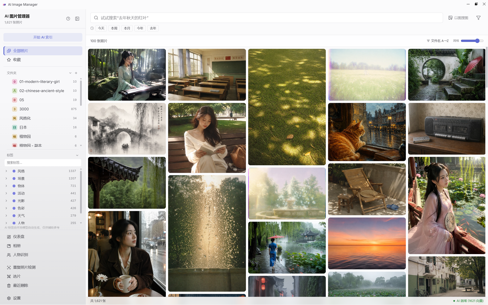 | 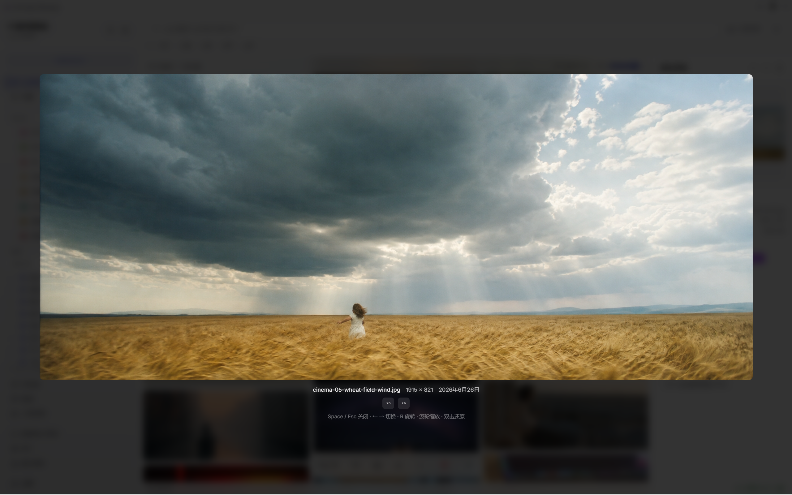 |
|:---:|:---:|
| 首页浏览 | 全屏灯箱 |
| 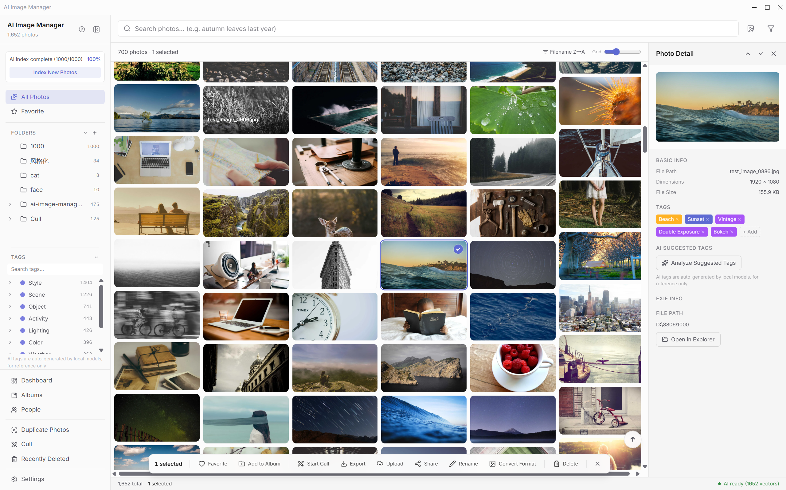 | 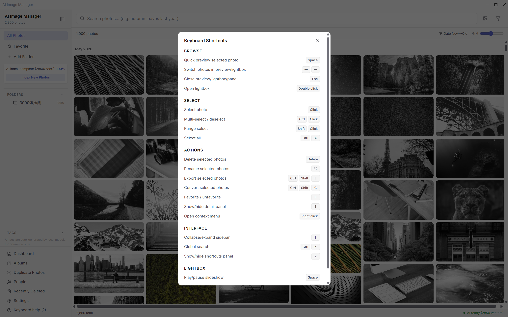 |
| EXIF 详情 | 快捷键面板 |

### AI 搜索

中英文自然语言搜索 — *"去年秋天在海边拍的日落"*。以图搜图。关键词 + 时间范围 + EXIF 条件组合筛选。

### 照片选片（新功能）

从大批量照片中快速筛选出最好的。三种模式：

- **PK 模式** — 基于 Elo 算法的两两对比，三种强度（快速/标准/精细）
- **甄选模式** — 单张照片的保留/淘汰，支持快捷键操作
- **结果视图** — 排行榜导出，多选、Top-N、相册、批量操作

| 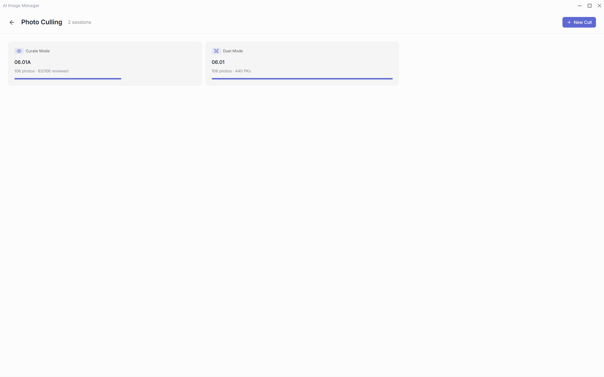 | 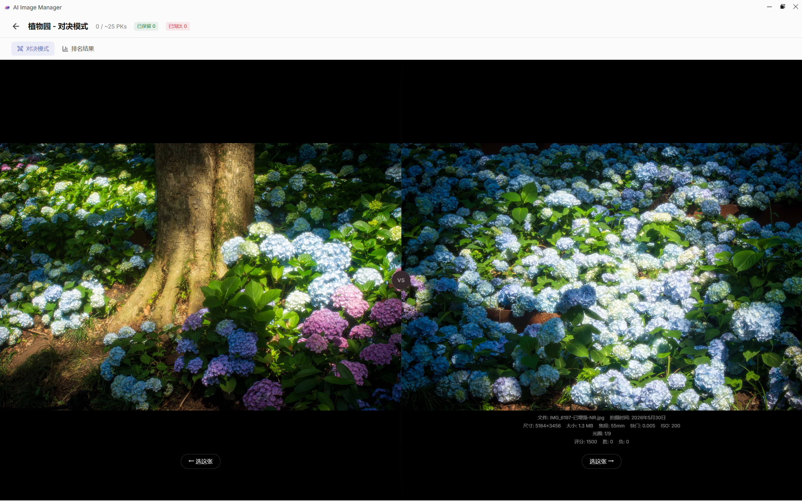 |
|:---:|:---:|
| 选片会话 | PK 对比 |
| 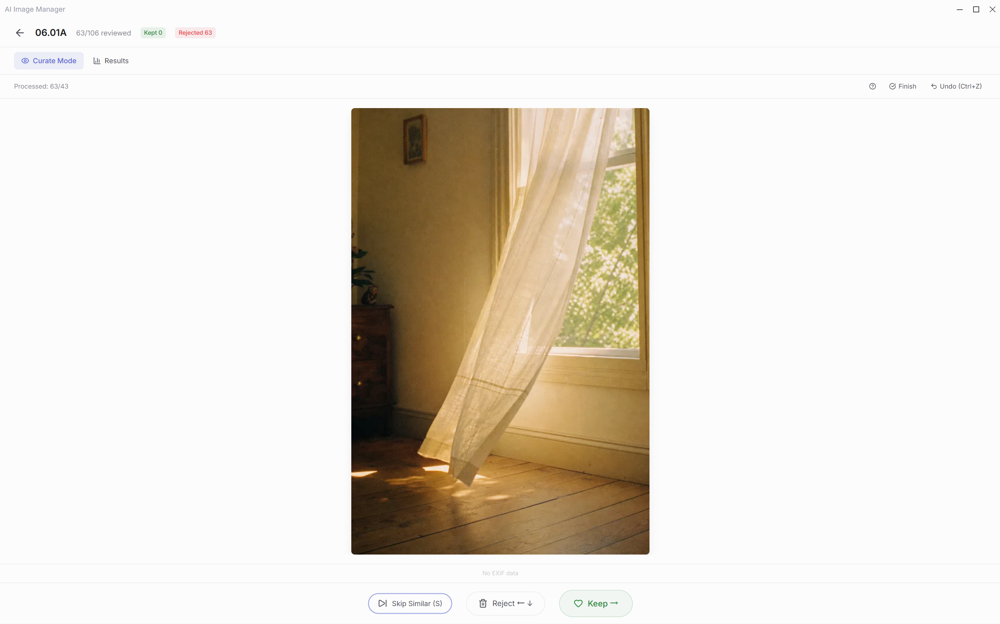 | 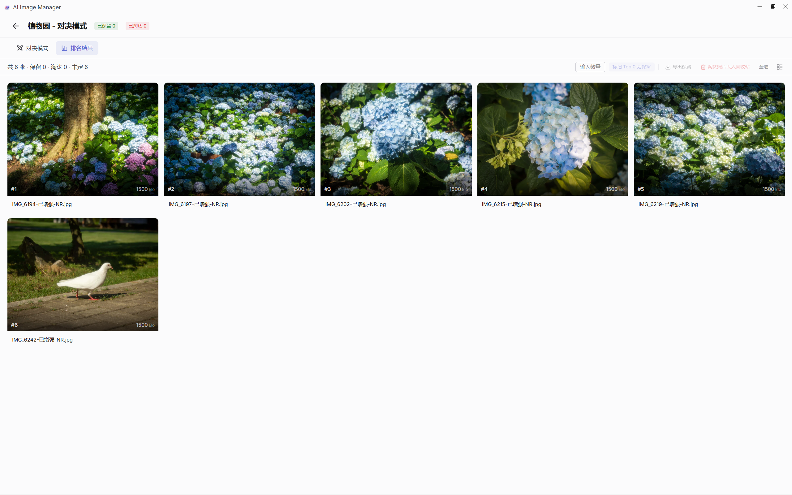 |
| 甄选模式 | 排行榜结果 |

### EXIF 仪表盘

相机/镜头使用统计，焦段/光圈/快门/ISO 分布，拍摄时间热力图，色彩分析（色相/饱和度/明度），GPS 地图。点击图表可下钻搜索。

| 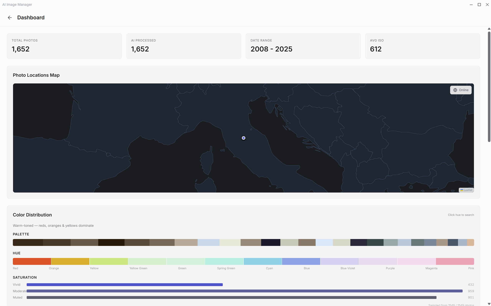 | 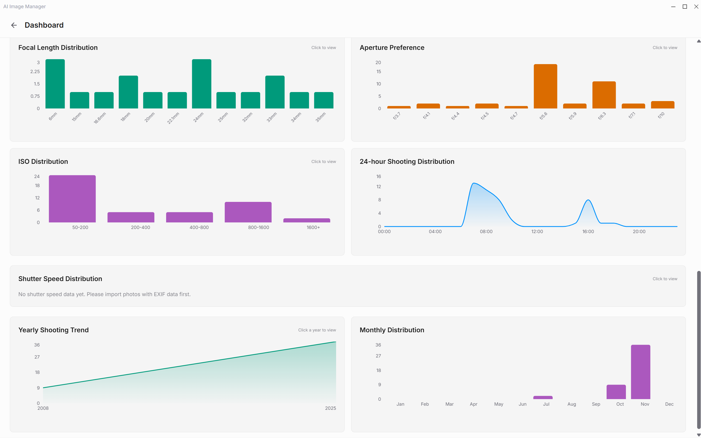 |
|:---:|:---:|
| 数据总览 | 色彩分析 |

### 人脸识别

ONNX 人脸检测 + 特征提取，自动聚类身份，支持合并/拆分/重命名。**DirectML GPU 加速，人脸检测提速 6.6 倍**，无 GPU 自动回退 CPU。RAW 文件通过内嵌 JPEG 预览支持。

| 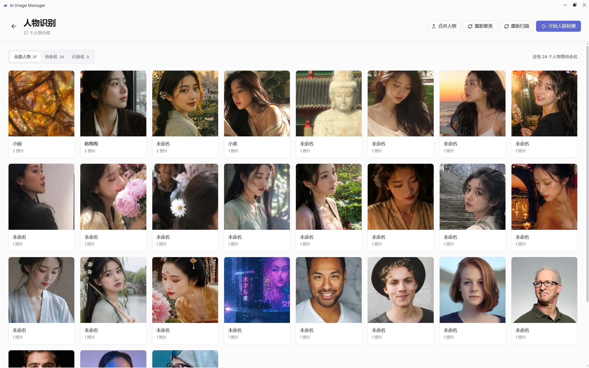 | 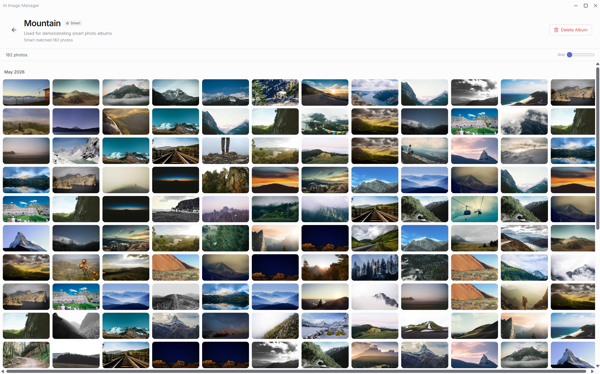 |
|:---:|:---:|
| 人脸识别 | 智能相册 |

### 更多功能

- **智能相册** — 基于规则引擎自动聚合（日期/EXIF/标签/AND/OR）
- **重复检测** — pHash 预筛选 + CLIP 相似度精排，批量清理
- **AI 自动标签** — 136 个候选标签，9 大类别（场景/人物/动物/物体/风格/天气...）
- **批量操作** — 重命名、格式转换、尺寸调整、水印
- **云端分享** — WebDAV / S3 上传，独立 HTML 分享页面
- **系统集成** — 托盘驻留、全局快捷键、开机自启、发送到、软删除 30 天回收站

| 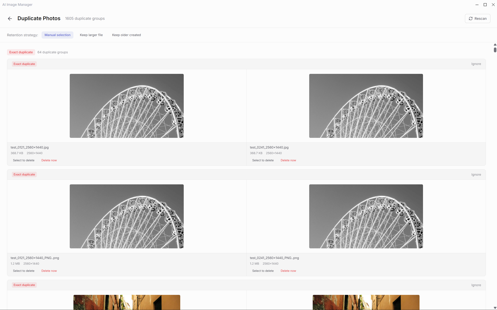 | 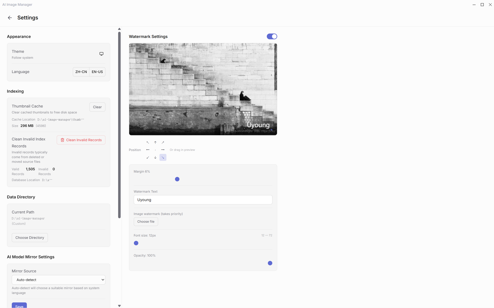 |
|:---:|:---:|
| 重复照片检测 | 设置页 |

---

## 首次启动

**安装包已内置 AI 模型** — 首次启动无需联网下载。如果模型损坏或被误删：

1. 设置 → AI 模型镜像 → 切换为 `hf-mirror.com`（国内推荐）
2. 或运行：`.\scripts\download-model.ps1`
3. 或手动从 [hf-mirror.com](https://hf-mirror.com/Xenova/clip-vit-base-patch32/tree/main) 下载放入 `%APPDATA%\AI Image Manager\models\`

---

## 性能基准

> Windows 11, Ryzen 7, 16GB RAM, NVMe SSD, CLIP ViT-B/32 量化模型本地推理

| 照片数量 | 扫描索引 | AI 嵌入 | **总计** |
|--------|:------:|:------:|:------:|
| **1 千** | ~1 分钟 | ~1.5 分钟 | **~2.5 分钟** |
| **1 万** | ~7 分钟 | ~15 分钟 | **~22 分钟** |
| **10 万** | ~70 分钟 | ~40 分钟 | **~1.8 小时** |

第一阶段：pHash + EXIF + 缩略图（4 并发）。第二阶段：CLIP 向量嵌入（2 Worker 进程池）。首次全量后增量索引秒级完成。

---

## 技术栈

| 层 | 技术 |
|----|------|
| 桌面框架 | Electron 41 |
| 前端 | React 19 + TypeScript (strict) |
| 构建 | Vite 8 + Tailwind CSS 4 |
| UI | shadcn/ui + Radix UI |
| IPC | oRPC（类型安全） |
| 数据库 | better-sqlite3 + Drizzle ORM |
| 图片处理 | sharp |
| AI 推理 | Transformers.js + onnxruntime-node (DirectML GPU) + LanceDB |
| 测试 | Vitest + Playwright |

---

## 开发

```bash
git clone https://github.com/Uyoung666/ai-image-manager.git
cd ai-image-manager
npm install
npm run dev
```

需要 Node.js 22+ 和 Windows 10/11。

```bash
npm run make          # 打包 Windows 安装包
npm run test          # 单元测试
npm run test:e2e      # E2E 测试
npm run check         # 代码检查
```

---

## 隐私

**100% 本地处理。** 无遥测、无后台上传、无统计。AI 模型通过 ONNX Runtime 在本地推理。云端功能仅在手动配置后触发。

---

## License

MIT © Uyoung

基于 [electron-shadcn](https://github.com/LuanRoger/electron-shadcn) 模板构建。
