# AI Image Manager

<div align="center">

**面向 Windows 的本地优先 AI 照片管理工具**

在自己的电脑上索引、搜索、整理、选片、分析和分享照片；照片库不需要迁移到应用专用目录。

[](https://github.com/Uyoung666/ai-image-manager/releases/latest)
[](#系统要求)
[](LICENSE)
[](https://www.electronjs.org/)

[官方网站](https://ai-image-manager.uyoungvision.cn) · [下载 v2.0.0](https://github.com/Uyoung666/ai-image-manager/releases/latest) · [使用指南](GUIDE.md) · [English](README.en.md)

</div>

---

## v2.0.0 首版定位

v2.0.0 是 AI Image Manager 的全新公开发布起点。本项目面向摄影师、内容创作者、设计师和拥有长期照片库的 Windows 用户，提供一套围绕本地文件夹工作的照片管理流程：先就地索引，再通过自然语言、相似图片、元数据和文件夹结构找到照片，最后完成整理、选片、分析、导出或分享。

v2.0.0 的文档、性能数据和隐私说明均以当前版本实际行为为准，不对历史版本作升级兼容、数据格式或功能连续性承诺。

## 核心理念

- **本地优先**：照片、缩略图、EXIF、AI 向量和人物特征默认在本机处理和保存。
- **就地索引**：应用读取你选择的照片文件夹，不要求先复制或迁移原始照片。
- **按需联网**：自动更新会访问更新服务；WebDAV/S3 和诊断提交只有在用户主动启用或执行时才会产生相应网络访问。
- **面向真实图库**：增量索引、虚拟化照片网格和独立 AI Worker 适合持续增长的本地图库。
- **摄影工作流集中**：浏览、筛选、人物整理、重复检测、专业选片、EXIF 分析和导出分享在同一个桌面应用中完成。

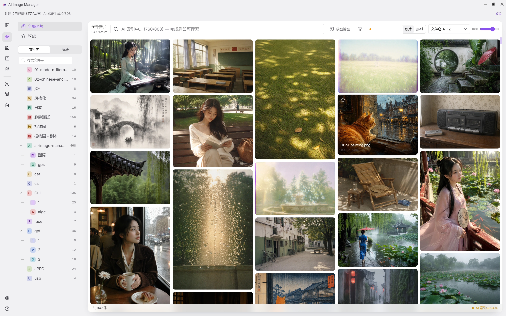

## 快速开始

### 下载与安装

从 [GitHub Releases](https://github.com/Uyoung666/ai-image-manager/releases/latest) 下载 v2.0.0：

- **安装版**：适合长期使用，提供 Windows 安装、快捷方式和更新能力。
- **便携版**：解压后直接运行，适合临时使用或不希望写入系统安装目录的场景。

首次启动会引导你：

1. 选择应用数据目录。该目录用于数据库、缩略图、向量索引和本地模型等派生数据。
2. 检测并选择是否启用 DirectML GPU 加速。
3. 选择中文或 English 界面。

发布包包含当前版本所需的 AI 模型，正常安装后不需要为首次使用额外下载模型。若模型文件缺失或校验失败，应用可能提示重新获取模型；这类获取行为需要网络连接。

### 第一次导入

1. 点击主页的 **添加文件夹**，或将照片文件夹拖入应用窗口。
2. 等待扫描、缩略图和 EXIF 处理完成。导入在后台队列中执行，期间可以继续浏览已有照片。
3. 在侧边栏查看 **AI 智能索引** 进度。语义搜索、以图搜图、视觉重复检测和部分 AI 标签能力需要完成相应索引。

详细操作、快捷键和故障排查请阅读 [《使用指南》](GUIDE.md)。

## 系统要求

| 项目 | 要求 |
| --- | --- |
| 操作系统 | Windows 10 / 11，64 位 |
| 处理器 | x64 处理器 |
| 内存 | 建议 8 GB 及以上；大型图库建议 16 GB 及以上 |
| 存储 | 建议使用 SSD，并为缩略图、数据库、向量索引和模型预留空间 |
| GPU | 可选；支持 DirectML 的 NVIDIA、AMD 或 Intel GPU 可加速部分 AI 任务，不支持时自动使用 CPU |
| 运行库 | AI Worker 或原生依赖启动失败时，可能需要 Visual C++ 2015–2022 x64 Redistributable |

实际性能会受到图片格式、分辨率、图库所在磁盘、系统负载、CPU、GPU 和内存等因素影响。

## 主要功能

### 1. AI 搜索与全局检索

- 中文和英文自然语言语义搜索，例如“去年秋天的红叶”“sunset by the beach”。
- 以图搜图：选择参考图片，查找视觉内容相近的照片。
- 文件名通配符搜索，例如 `IMG_*.jpg`、`*2025*`、`DSC_00??.ARW`。
- 按日期、相机、镜头、焦距、光圈、ISO、格式和标签组合筛选。
- `Ctrl+K` 打开全局搜索，覆盖照片、标签、相册、人物、设置和页面导航。
- AI 不可用或尚未完成索引时，仍可使用文件名、标签、人物和元数据检索；语义结果需要等待对应索引完成。

### 2. 浏览与照片管理

- 虚拟化瀑布流、时间分组和真实文件夹树。
- 单选、多选、范围选择、框选、收藏和滚动位置恢复。
- `Space` 快速预览；双击进入灯箱，支持全屏、幻灯片、缩放、平移、旋转和缩略图导航。
- 详情面板显示文件信息、EXIF、标签、位置和原始路径。
- 文件夹外观设置可为常用文件夹配置颜色和图标，不会修改磁盘上的真实文件夹。
- 应用内软删除和 30 天回收站，支持恢复、清理和移入 Windows 系统回收站。

| 快速预览 | 照片详情 |
| :---: | :---: |
|  | 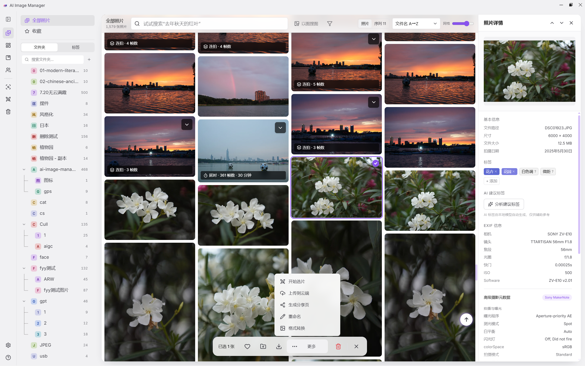 |

### 3. AI 索引、标签与人物

- 使用本地视觉模型生成图片向量，支持语义搜索和相似度检索。
- 支持暂停、恢复和增量处理新照片。
- 手动标签、父子标签层级和 AI 标签建议。
- 本地人脸检测与特征提取，自动聚类人物并支持命名、合并、隐藏、拆分和重新聚类。
- DirectML 可用于图像嵌入和人脸识别；探测失败或运行失败时自动回退 CPU。

| 人物整理 | AI 索引与重复检测 |
| :---: | :---: |
| 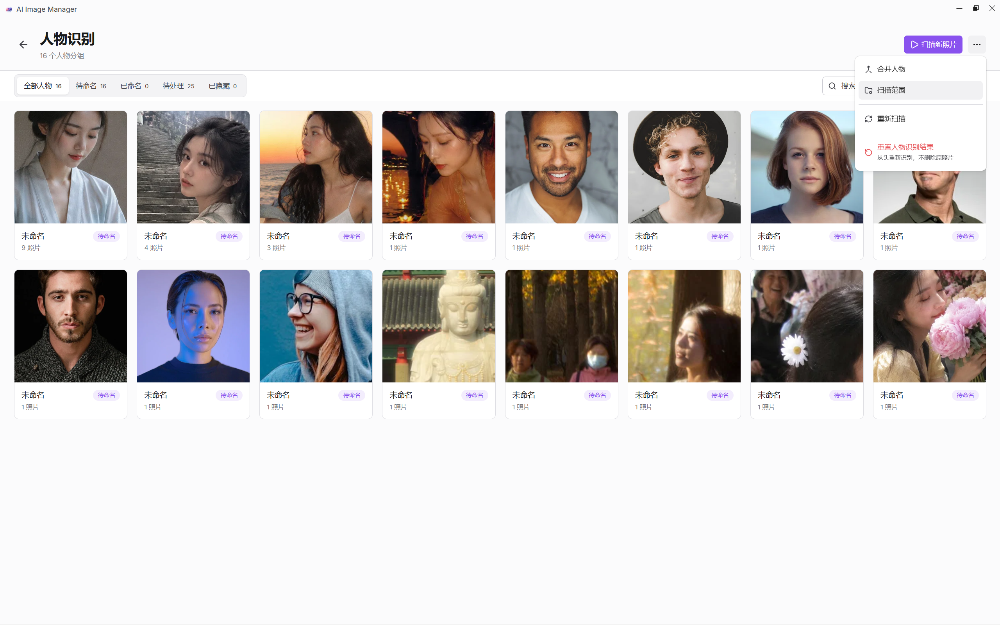 | 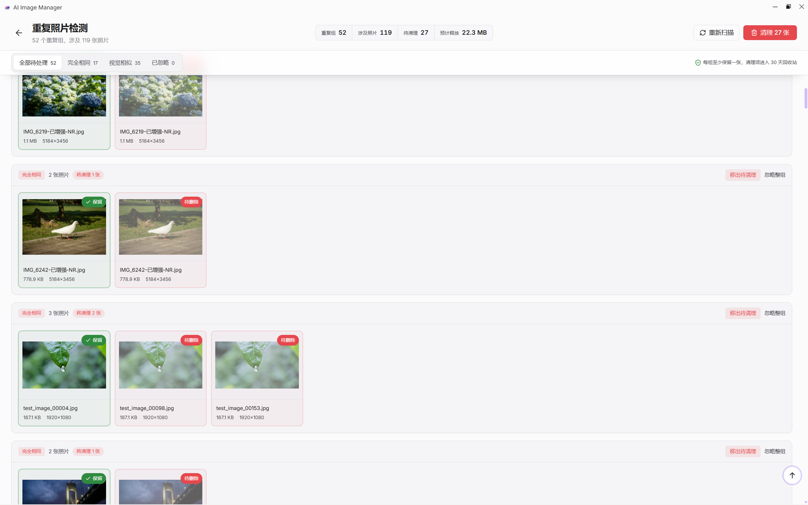 |

### 4. 相册、序列与漫游

- 普通相册：手动添加、移除和设置封面。
- 智能相册：按日期、相机、镜头、标签、焦距、光圈、ISO 和格式等规则自动匹配。
- 序列识别：识别连拍和延时摄影，支持严格、平衡、宽松或自定义预设。
- 序列管理：查看序列帧、播放序列、选择代表照片、调整顺序和拆分序列。
- 漫游：手动或在应用闲置时浏览时光胶囊、主题放映、图库遗珠等内容，并可将一轮漫游保存为相册。

### 5. 专业选片

- **PK / Duel 模式**：两张照片对比，使用 Elo 评分形成排序。
- **甄选 / Curate 模式**：逐张决定保留、淘汰或跳过相似照片。
- PK 支持快速、标准和精细三种比较策略，以及同步缩放、EXIF 叠加、撤销和疲劳提醒。
- 结果页支持排名查看、Top-N 标记、多选、加入相册、导出和移入回收站。

| PK 对比 | 甄选模式 | 结果排名 |
| :---: | :---: | :---: |
| 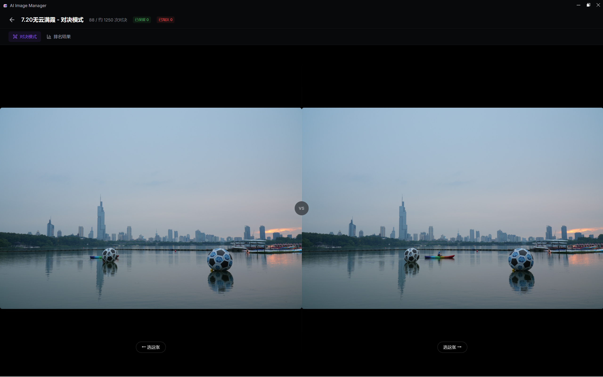 | 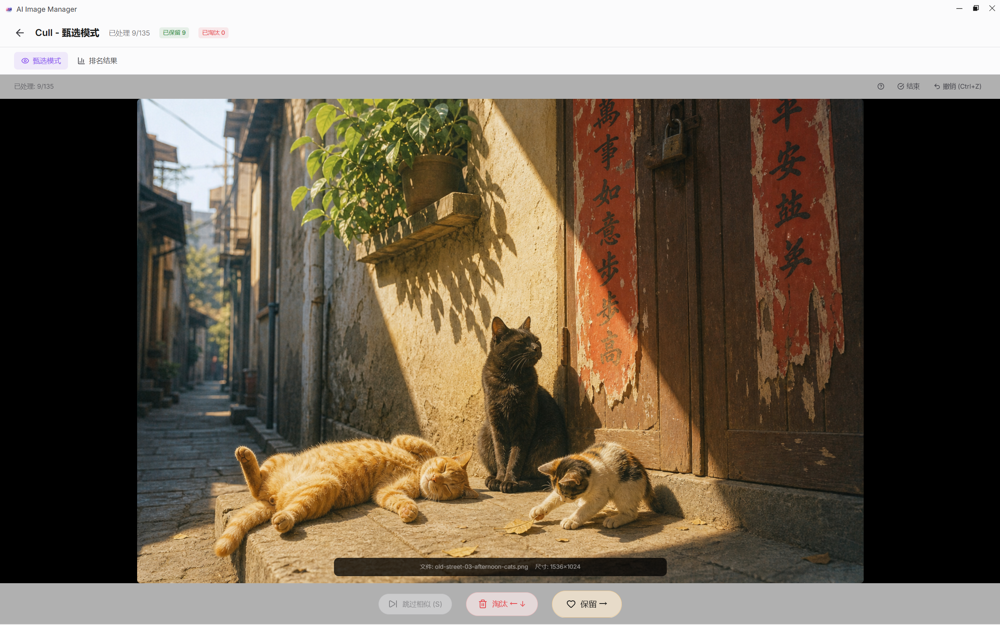 | 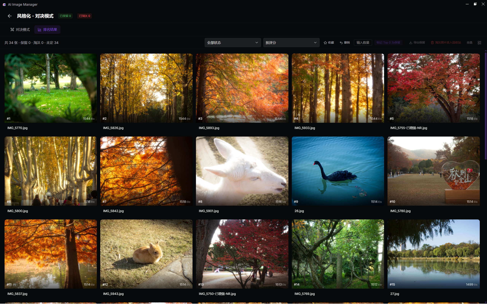 |

### 6. 重复检测与影像分析

- 检测文件内容完全相同、视觉上相同和视觉上相似的照片组。
- 结合文件哈希、感知哈希和视觉相似度进行候选分组；视觉相似不等于文件重复，清理前应人工确认。
- 提供保留者、忽略组和批量清理操作，并使用 30 天回收站保护误操作。
- 仪表盘按概览、器材、曝光、拍摄技术、时间、地点与色彩展示图库统计。
- 图表可下钻到匹配照片，统计范围支持全部、今年、近 12 个月和自定义日期。

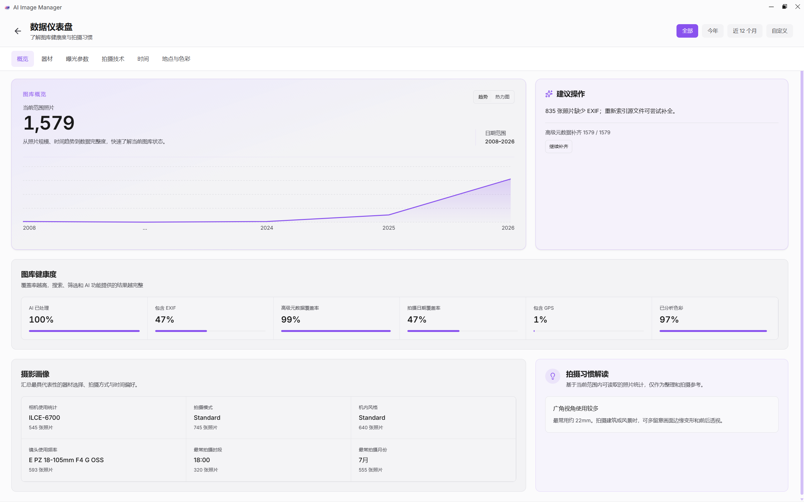

### 7. 批量处理、导出与分享

- 批量收藏、加入相册、重命名、格式转换、缩放和水印。
- 支持将原图或压缩版本导出为 ZIP；压缩导出可设置质量和最大宽度。
- 生成包含缩略图、EXIF 和标签的单文件 HTML 分享页面。
- 支持文字或图片水印、9 个锚点、透明度、字号/缩放和预览。
- 可选集成系统托盘、开机启动、全局快捷键和 Windows “发送到”。

### 8. 云存储与分享

支持以下用户可配置的存储提供商：

- **WebDAV**：适用于坚果云等兼容 WebDAV 的服务。
- **Amazon S3 / S3 兼容存储**：需要 endpoint、bucket、access key 和 secret key 等配置。

云配置不会自动上传照片。只有用户在设置中完成配置并主动执行上传或发布分享页面时，应用才会向所选服务发送对应数据。云服务的可用性、权限和隐私政策由服务提供商决定。

## v2.0.0 界面预览

以下截图来自 v2.0.0 实测界面，补充展示预览、序列、相册、设置、选片和仪表盘流程。

| 灯箱 | 人脸待处理 |
| :---: | :---: |
| 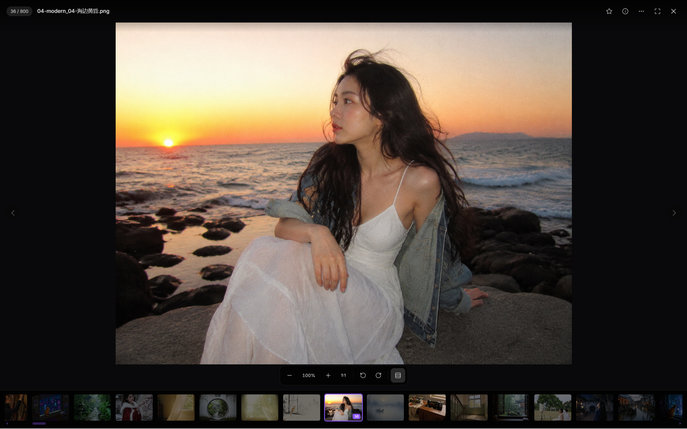 | 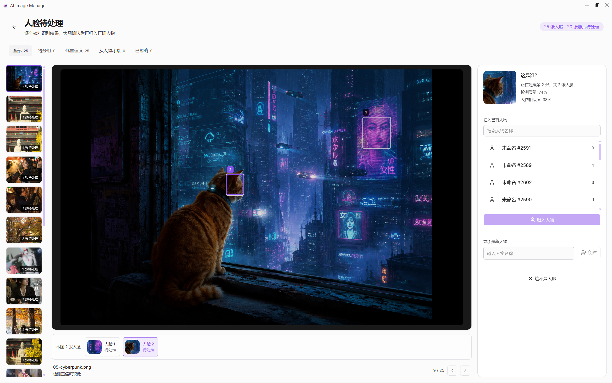 |

| 序列及序列详情 | 智能相册 |
| :---: | :---: |
| 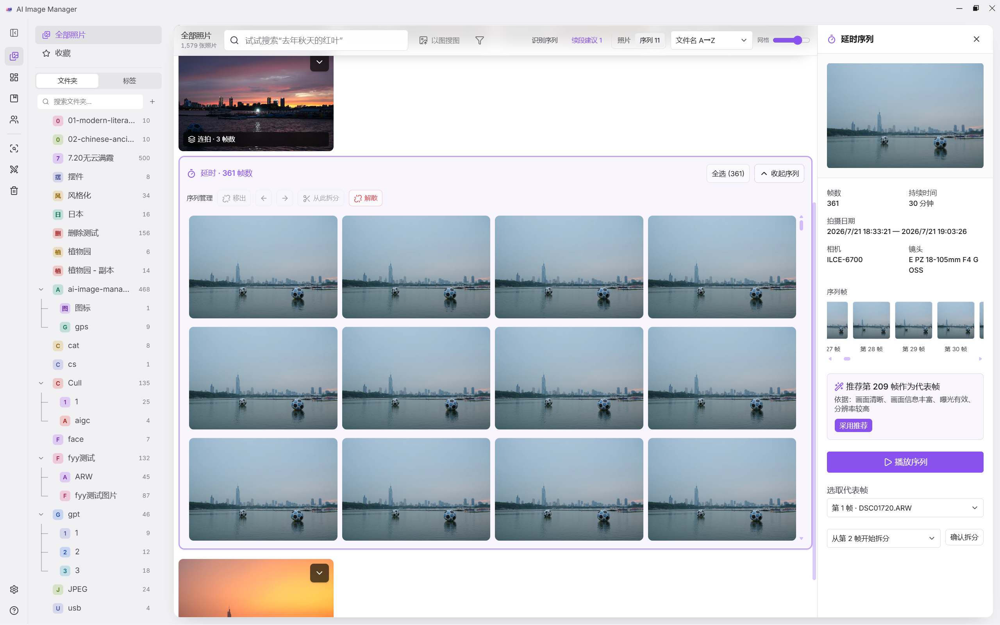 | 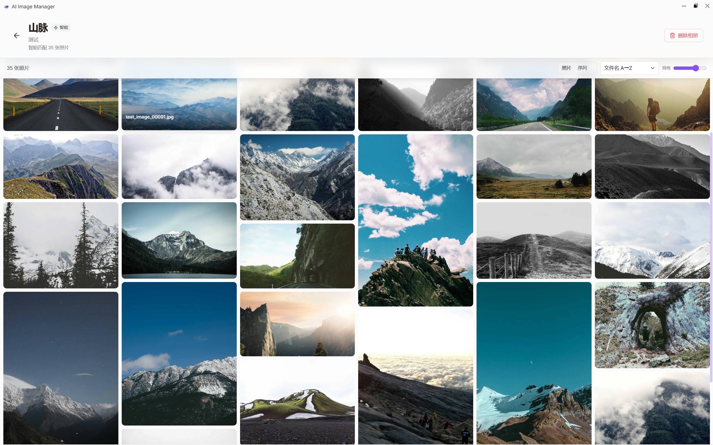 |

| 快捷键 | 设置页 |
| :---: | :---: |
| 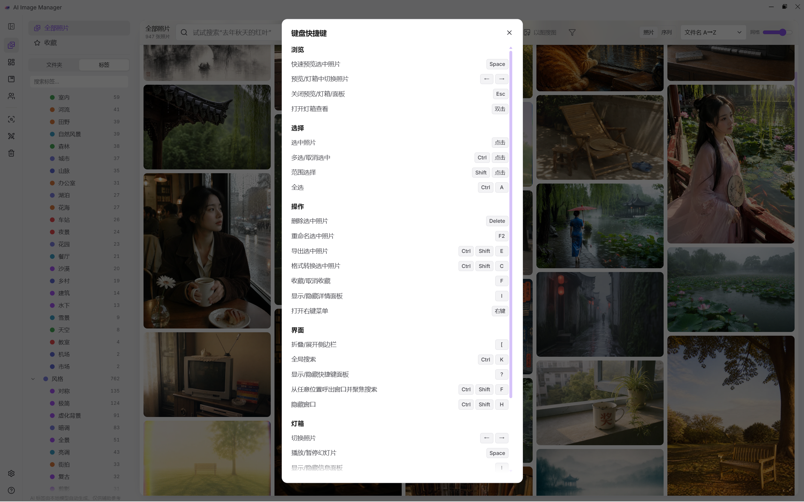 | 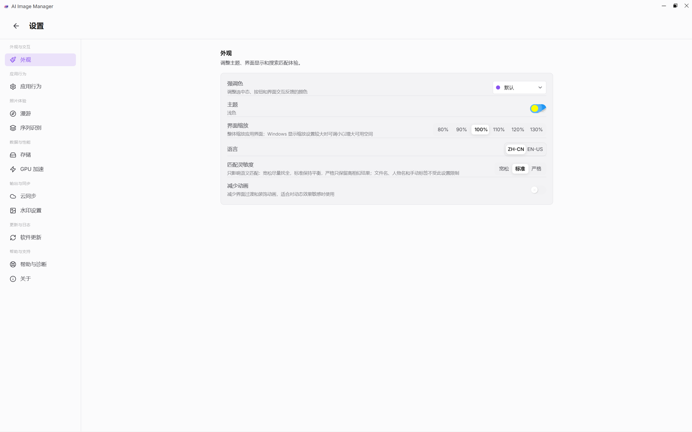 |

| 选片工作区 | 数据仪表盘（二） |
| :---: | :---: |
| 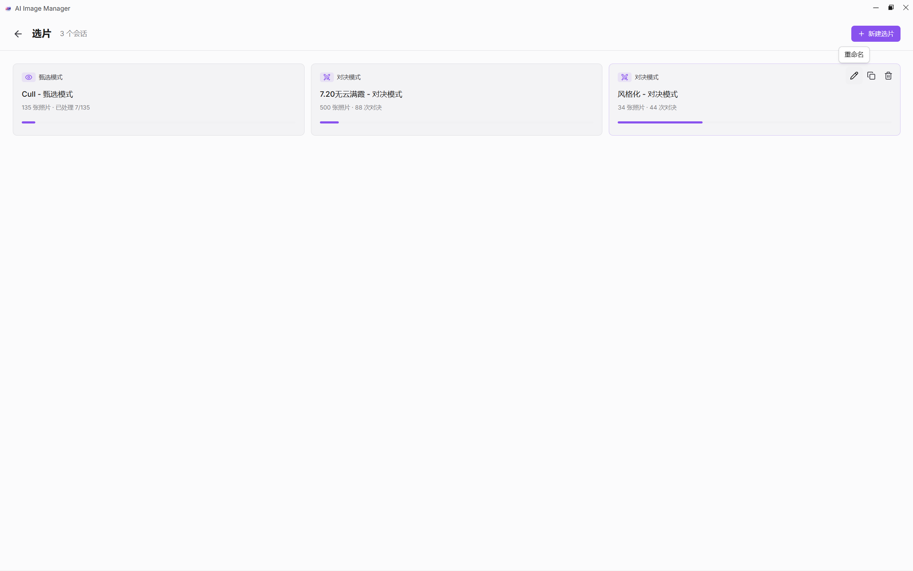 | 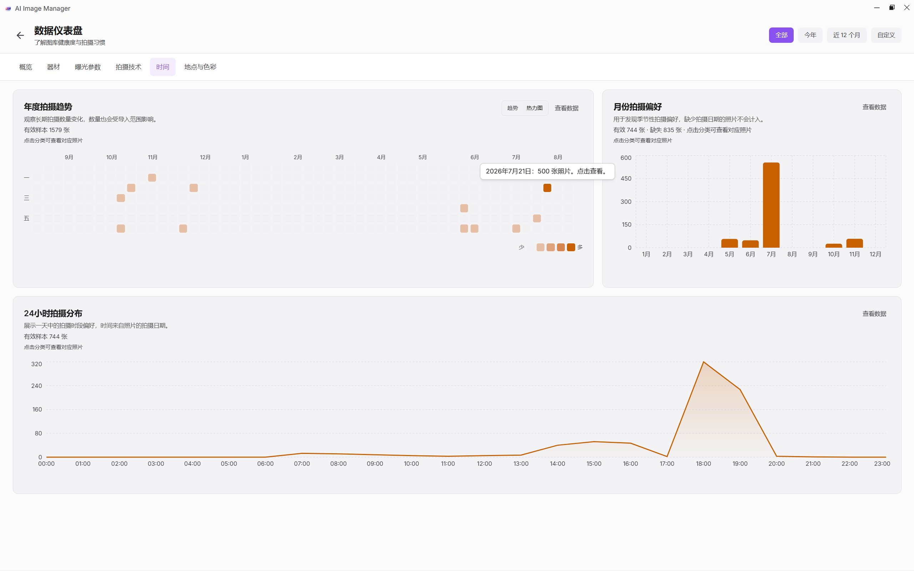 |

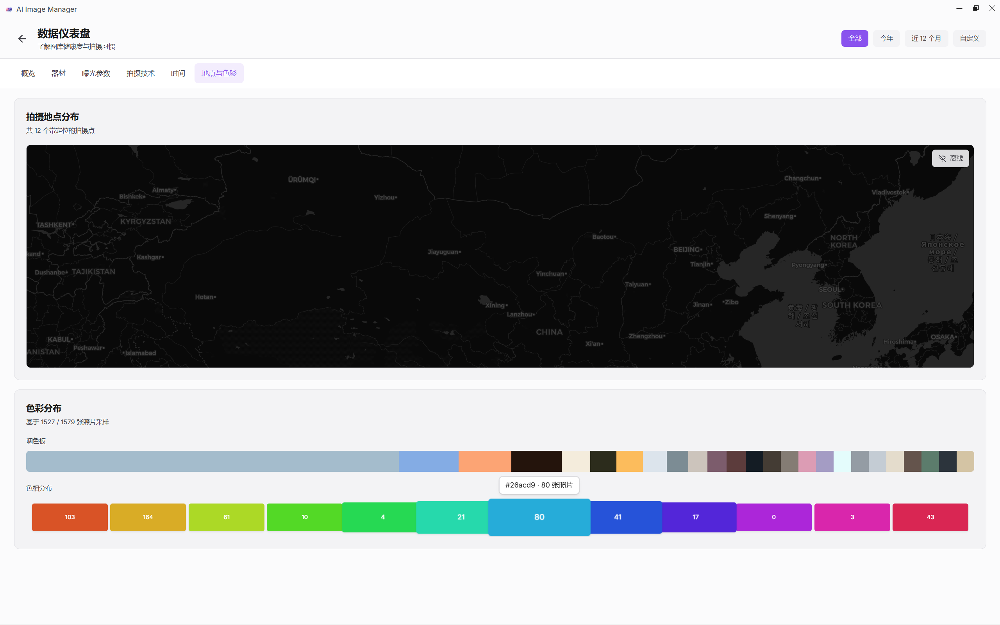

## 支持的图片格式

| 类别 | 格式 |
| --- | --- |
| 常用格式 | JPG、JPEG、PNG、WebP、AVIF、TIFF、TIF、HEIC、HEIF、GIF、BMP、ICO |
| 相机 RAW | CR2、CR3、NEF、NRW、ARW、SRF、SR2、DNG、ORF、RW2、RAF、PEF、RWL、3FR、RAW |

共支持 27 种扩展名。RAW 文件主要通过读取文件内嵌 JPEG 预览来生成缩略图、预览和 AI 分析；如果 RAW 文件不包含可用内嵌预览，结果可能受限。

## 性能参考

以下是当前版本已记录的实际观测值，数值四舍五入到秒：

| 工作量 | 导入 | AI 嵌入 | 总耗时 |
| ---: | ---: | ---: | ---: |
| 1,000 张照片 | 30 秒 | 32 秒 | **62 秒** |
| 单日 10,000 张 JPG 照片 | 约 340 秒（5 分 40 秒） | 约 746 秒（12 分 26 秒） | **约 1,086 秒（18 分 06 秒）** |

单日 10,000 张测试完成了导入、缩略图/EXIF/哈希准备和 SigLIP 嵌入，测试后的派生数据已清理。该结果仅作为当前版本的一次性能观测，不代表所有设备、图库或图片类型，也不承诺固定耗时。

## 工作方式与数据边界

```text
你选择的照片文件夹
        │
        ├─ 扫描与增量监听 ──► SQLite / EXIF / 文件状态
        ├─ 缩略图与预览 ─────► 本地缓存 / 浏览 / 灯箱
        └─ AI Worker ───────► SigLIP 向量 / 人脸特征 / AI 标签
                                      │
                                      └─► 语义搜索、以图搜图、人物聚类、重复检测

派生数据存放在应用数据目录；原始照片仍保留在用户选择的文件夹中。
```

应用不会接管或自动迁移原始照片。移动或删除源文件后，原索引可能变为无效记录，可在设置中清理。数据库、缩略图、向量索引、模型和日志的位置由数据目录设置决定。

## 隐私、网络与诊断

- 照片索引、缩略图生成、EXIF 读取、向量计算、人脸特征提取和搜索处理默认在本机完成。
- 应用不会自动上传照片内容；也不会把照片、数据库、EXIF、人脸/向量数据或搜索词作为诊断包内容。
- 如果启用自动更新，应用会访问更新服务检查并下载新版本。可在 **设置 → 软件更新** 中调整自动更新、提醒和代理。
- 如果配置 WebDAV/S3 并主动上传照片或分享页面，对应数据会发送到用户选择的服务。
- **设置 → 帮助与诊断** 可在本地生成严格脱敏的诊断包。诊断包不会自动上传，只有用户主动导出或附加到 Issue 时才会离开设备；原生崩溃转储默认关闭。

以上说明描述的是 v2.0.0 当前实现边界，不替代所连接云服务或更新服务的隐私政策。

## 内置 AI 模型与许可

发布包包含当前版本需要的模型资产，详细版权和许可信息见 [THIRD_PARTY_MODEL_NOTICES.md](THIRD_PARTY_MODEL_NOTICES.md) 及 [`licenses/`](licenses)。以下模型均在本机运行，职责彼此独立：

| 模型 | 主要能力 | 明确边界 | 许可 |
| --- | --- | --- | --- |
| **SigLIP Base Patch16-224** | 图像和文本嵌入；768 维、L2 归一化的统一向量空间；文本搜图、以图搜图、AI 标签建议、视觉重复检测和相似候选分组 | 不负责图像生成、修图、OCR 或人脸识别 | Apache License 2.0 |
| **OPUS-MT Chinese to English** | 将中文搜索词在本地翻译为英文查询，帮助中文查询进入 SigLIP 文本嵌入流程 | 不生成图像，不提取图像或人脸特征，也不是通用翻译服务 | CC BY 4.0 |
| **YuNet** | 本地人脸检测和 5 点面部关键点定位，输出人脸框与位置特征供人物流程使用 | 不判断人物身份，不负责通用图像嵌入或语义搜索 | MIT License |
| **SFace** | 本地 128 维人脸特征嵌入，用于人脸相似度、人物聚类和人物整理 | 不负责人脸检测，不负责通用图像嵌入或文本搜图 | Apache License 2.0 |

### 当前标准版模型能力

当前标准嵌入模型适配器为 `siglip-v1-base-patch16-224`（SigLIP Base Patch16-224）：

- 同时提供图像嵌入和文本嵌入，使用 768 维、L2 归一化的统一向量空间。
- 支持中文和英文语义搜索，即文本搜图。
- 支持以图搜图和视觉相似度排序。
- 支持 AI 标签建议所需的图像/标签相似度计算。
- 支持视觉重复照片检测和相似照片候选分组。
- 使用当前正式校准的 `siglip-v1-base-patch16-224-default` 阈值 profile。

中文查询进入文本搜图流程前，必要时由 OPUS-MT 在本地翻译为英文；人物相关能力则由 YuNet（检测与关键点）和 SFace（人脸特征）独立完成。模型输出用于相似度、检索和辅助整理，不代表对照片内容的绝对判断。

## 本地开发

### 环境准备

- Windows 10 / 11
- [Node.js 22](https://nodejs.org/)
- npm
- 可编译 `better-sqlite3`、LanceDB、Sharp 和 ONNX Runtime 等原生依赖的 Windows C++ 构建环境

### 启动项目

```bash
git clone https://github.com/Uyoung666/ai-image-manager.git
cd ai-image-manager
npm ci
npm run dev
```

`npm ci` 后会执行 Electron 原生模块重建。开发环境中的模型文件应按项目说明准备；发布构建会从允许的模型清单中整理模型资产。

### 常用命令

| 命令 | 用途 |
| --- | --- |
| `npm run dev` | 启动 Electron + Vite 开发环境 |
| `npm test` | 运行 Vitest 测试 |
| `npm run test:e2e` | 运行 Playwright E2E 测试 |
| `npm run check` | 执行格式和 lint 检查 |
| `npm run make` | 构建 Windows 分发包 |
| `npm run db:generate` | 生成 Drizzle 迁移 |
| `npm run db:migrate` | 应用数据库迁移 |

## 技术架构

| 层级 | 主要技术 |
| --- | --- |
| 桌面运行时 | Electron 41、Electron Forge |
| 渲染界面 | React 19、TypeScript、TanStack Router / Query |
| UI | Tailwind CSS 4、Radix UI、shadcn/ui |
| 数据与索引 | SQLite、better-sqlite3、Drizzle ORM、LanceDB |
| 图片与元数据 | Sharp、ExifTool、exifr |
| AI 推理 | Transformers.js、ONNX Runtime、DirectML |
| 工程与测试 | Vite、Vitest、Playwright、Biome / Ultracite |

主要目录：

```text
src/routes/       React 页面与路由
src/components/   可复用 UI 组件
src/actions/      渲染进程侧 IPC 封装
src/ipc/          类型化 IPC 路由与处理器
src/services/     索引、缩略图、AI、人物、云同步等服务
src/db/           数据库 schema 与访问层
src/tests/        单元、集成和 E2E 测试
```

## 相关文档

- [中文使用指南](GUIDE.md)
- [English User Guide](GUIDE.en.md)
- [English README](README.en.md)
- [第三方模型声明](THIRD_PARTY_MODEL_NOTICES.md)
- [版本与下载](https://github.com/Uyoung666/ai-image-manager/releases)

## 许可证

本项目采用 [MIT License](LICENSE) 发布。第三方模型和依赖分别遵循其对应许可证；请同时阅读 [THIRD_PARTY_MODEL_NOTICES.md](THIRD_PARTY_MODEL_NOTICES.md) 和 [`licenses/`](licenses) 中的声明。
